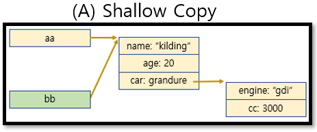
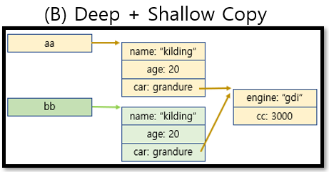
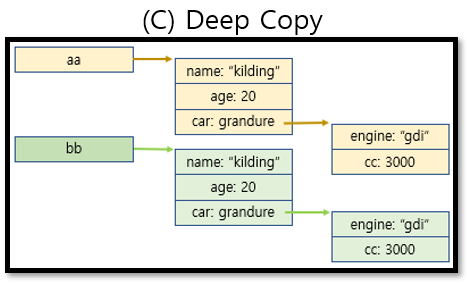

# JavaScript란

- 자바스크립트는 ‘웹페이지에 생동감을 불어넣기 위해’ 만들어진 프로그래밍 언어입니다.

- HTML/CSS와 완전히 통합할 수 있음

- 간단한 일은 간단하게 처리할 수 있게 해줌

- 모든 주요 브라우저에서 지원하고, 기본 언어로 사용됨

## 객체

- 자료형 챕터에서 배웠듯이 자바스크립트엔 여덟 가지 자료형이 있습니다.

- 이중 7가지 (문자열,숫자,bool,etc)는 오직 한가지 데이터만 담을수 있어 `원시형(primitive type)`이라고 부릅니다

- 하지만 객체는 원시형과 달리 다양한 데이터를 담을 수 있습니다.

- 객체는 `프로퍼티`로 이루어 져있고 프로퍼티는 `key:value`값으로 나와있습니다.

```js
//객체 생성 방법

let user = new object({name:"kim",age:30})
// or
let user = {name:"kim",age:30}

// 객체 사용법

console.log(user.name); //kim 출력 

```
- 또한 아래와 같은 방법으로 객체를 수정 및 추가 할수 있습니다.

```js
user.name = "lee"
user.weight = 60;
// or
user["name"] = "lee"
user["wegiht"] = 60;

```
- 상수(`const`)로 객체를 만들어도 수정 할수있습니다

- 객체의 프로퍼티를 생성하는 방법에도 여러가지 방법이 있습니다.

```js
let fruit = "apple";
let bag = {
    [fruit] :5,
};

console.log(bag.?);

let test = {fruit};
console.log(test);
```

## 객체의 key를 확인하고 가져오는 함수 in, for...in

- 객체 안에 `프로퍼티`중 `key`값이 존재하는 하지 않는지 파악 하기위해 in이라는 함수를 사용합니다

```js
let english = {a:"a",b:"b",c:"c"}

console.log("a" in english)
```

- 객체의 모든 프로퍼티의 key값을 순회 하는 함수 `for...in`이라는 것도 존재합니다.

```js
let userinfo = {
    name:"kim",
    age:20,
    gender: "male",
}

for(let info in user ){
    console.log(info)

    console.log(user[info]);
}

```
- 하지만 정수key만으로 객체를 만들면 `for...in`을 통해서 가져오는 `key`값은 우리가 선언한 순서가 아닌 정렬되어진 값으로 받아오게 됩니다.


## 참조에 의한 객체 복사

- 객체와 원시타입(number,string...)과 다른점은 reference가 저장되고 복사 된다는 것입니다.

```js
let user1 = "kim";
let user2 = user1;

console.log(user1===uesr2); // false

let user1= {
    name:"kim"
}

let uesr2 = user1;
console.log(user1===uesr2); // true
```

- 위 예시를 보면 서로 결과값이 다르게 나올겁니다

- 그 이유는 변수에는 같은 문자열 `kim`라는 변수들이 따로 따로 만들어지기 때문입니다.

- 하지만 객체의 경우 객체가 그대로 저장되는 것이 아니라, 객체가 저장되어있는 `메모리 주소`인 객체에 대한 `참조값`이 저장됩니다

- 객체는 메모리 내 어딘가에 저장되고, 변수 `user1, user2`는 객체가 존재하는 위치가 저장됩니다.  


```js

let testFunction1 = function(){};

let testFunction2 = function(){};

console.log(testFunction1 === testFunction2);

```

- 할당된 변수를 복하면 동일한 객체에 대한 참조 값이 하나 더 만들어진다

- 그렇다면 객체를 복사해서 데이터를 수정하고 올바르게 수정되면 사용하고, 아니면 롤백 시키기위해 전에 있는 객체를 사용하고싶을떄 어떻게 해야할까?

- 방법은 `for...in`을 사용하거나 `assign,spread` 연산을 통해 만들수 있다.

- 하지만 `for...in`이나 `assign`의 경우 객체 안의 객체가 있을때 사용하기 번거롭습니다.

- 따라서 `spread`연산을 통해 쉽게 복사를 할수있습니다.

```js
const original = {a:1, b:2, c:{d:3}}

const copied = { ...original }

original.a = 1000
original.c.d = 3000

console.log(copied.a) // 1
console.log(copied.c.d) // 3000

console.log(original.a) // 1000
console.log(original.c.d) // 3000 뭐지?!
```

- 객체를 복사해서 값을 변경해서 확인해 봤는데 `copied.a`와 `original.a`가 서로 영향이 미치지 않는다는것을 알수있었습니다.

- 하지만 `copied.c.d`와 `original.c.d`는 왜 같게 나오는건지 이상하다고 생각 하셔야합니다 .

- 이러한 문제는 spread가 `Deep+shallow Copy`를 했기 때문입니다.

- 먼저 `shallow`, `Deep+sahllow`, `Deep`에 대해 알아보도록 하겠습니다

<p align="center"></p>


<p align="center"></p>


<p align="center"></p>

- 그림을 보니 이해가 좀 되셨나요. 내부의 객체까지 복사를 하지 못했기 때문에 `3000`이라는 값이 나온겁니다.

- 그렇다면 Deep Copy는 어떻게 하는걸까요?

- 방법은 `JSON`객체의 메소드 이용법, 외부 라이브러리 `Lodash,immer,imutable`을 활용하는 방법이 있습니다.

```js
const cloneObj = obj => JSON.parse(JSON.stringify(obj))

const original = {
  a: 1,
  b: {
    c: 2,
  },
  d: () => {
    console.log("hi")
  },
}

const copied = cloneObj(original)

console.log(copied.d) // undefined

// immer
import { produce } from 'immer'

const state = {
  hello: 'world',
}

const nextState = produce(state, draft => {})

nextState.hello = 'new world'
console.log(state, nextState)
```

## 가비지 컬레션

- 원시값, 객체, 함수 등 우리가 만드는 모든 것은 메모리를 차지합니다.

- 그렇다면 사용하다가 이제 더이상 쓸모없어지는 경우에는 어떻게 처분 할까요?

### 쓸모 없어지는 기준

- 자바스크립트는 도달 가능성(reachability) 이라는 개념을 사용해 메모리 관리를 수행합니다.

- ‘도달 가능한(reachable)’ 값은 쉽게 말해 어떻게든 접근하거나 사용할 수 있는 값을 의미합니다. 도달 가능한 값은 메모리에서 삭제되지 않습니다.

- 아래 소개해 드리는 값은 도달 가능하기 때문에, 명백한 이유 없이 삭제 되지 않습니다.

    - 현재 함수의 지역변수 매개 변수

    - 중첩 함수의 체인에 있는 함수에서 사용되는 변수와 매개변수

    - 전역 변수

```js
let tmp = {
    age : 18
}

tmp =null;
```

## 메서드와 this

- 객체는 실제 존재하는 객체를 표현하고자 합니다. 

- 이와 비슷하게 현실세계에서 객체들은 행동이나 기능을 할수 있습니다.

### 메서드 

- 언어에서 객체들은 행동이나 긴능을 메서드(객체의 함수라고 생각하면 편하다) 를 통해 구현할수 있습니다.

- 먼저 사람 객체를 만들고 인사를 하는 메서드를 구현해보도록 하겠습니다

```js
let person = {
  name: "kim",
  age: 20
};

person.sayHi = () => {
  console.log("안녕하세요!");
};

person.sayHi(); // 안녕하세요!
```

- 이런식으로 객체를 사용해서 개체를 표현하는 방식을 OOP(Object-oriented Programing)객체 지향 프로그래밍 이라고 부블빈다.

- OOP는 상당히 중요한데요, 올바를 객체의 선택법, 개체 사이의 상호작용, 객체 지향 설계 방법  등 많습니다


### 메서드와 this

- 메서드는 자신이 속한 객체의 프로퍼티에 대해 활용 할수 있어야합ㅈ니다.

- 메서드에서 프로퍼티를 사용하기위해 `this`를 통해 만들어 보겠습니다.

```js
let person = {
  name: "kim",
  age: 30,
  intro() {
    console.log(`my name ${name}`);
    console.log(`my name ${this.name}`);
    console.log(`my name ${person.age}`);
 };
};


person.intro(); // 안녕하세요!

```
### 자유로운 this

- 자바스크립트의 `this`는 다른 프로그래밍 언어의 `this`와 다릅니다.

- 자바스크립트에서는 모든 함수에 `this`를 활용할수 있습니다.

```js
function test() {
  console.log( this.name );
}
```

- 위 코드는 왜 에러가 발생하지 않을까요?

- 그 이유는 this의 값은 런타입에 결정이 되며 컨텍스트에 따라 바뀌게 됩니다.
> 런타임이 뭐야?? <a href= "https://www.youtube.com/watch?v=8aGhZQkoFbQ">런타임에 대해 배우기</a>

- 쉽게 생각하면 호출하는 위치에 따라 `this`값이 바뀌게 됩니다.

```js
let user = { name: "John" };
let admin = { name: "Admin" };

function sayHi() {
  console.log( this.name );
}

user.f = sayHi;
admin.f = sayHi;

user.f(); 
admin.f(); 

admin['f']();

```
- 화살표 함수는 다른 함수들과 달리 고유한 `this`를 가지지 않습니다.

- 화살표 함수에서 `this`를 사용하면 외부 함수에서 this를 사용합니다.

- 이부분은 나중에 다시 설명 하도록 하겠습니다.


## new 연산자와 생서자 함수 

- 이제 객체의 메서드를 넣고 활용하는것 까지 해보았습니다.

- 그런데 이런 함수들을 여러개 만들어서 사용하고 싶은데 어떻게 해야하나요

- 그럴때 `new`연산자를 사용하면 객체를 여러개 만들수 있습니다.

```js
function User(name){
    this.name = name;
    this.age = "male";
}
let user = new User("kim");

console.log(user.name);

console.log(user.age);

```

- `new`알고리즘이 작동하면 아래와 같은 알고리즘이 작동합니다

    - 1. 빈 객체를 만들어 this를 할당
    - 2. 함수 본문을 실행, `this`에 새로운 프로퍼티를 추가해 `this`를 수정
    - 3. `this`를 반환 

```js
function User(name) {
  this.age= "male";

}
```

