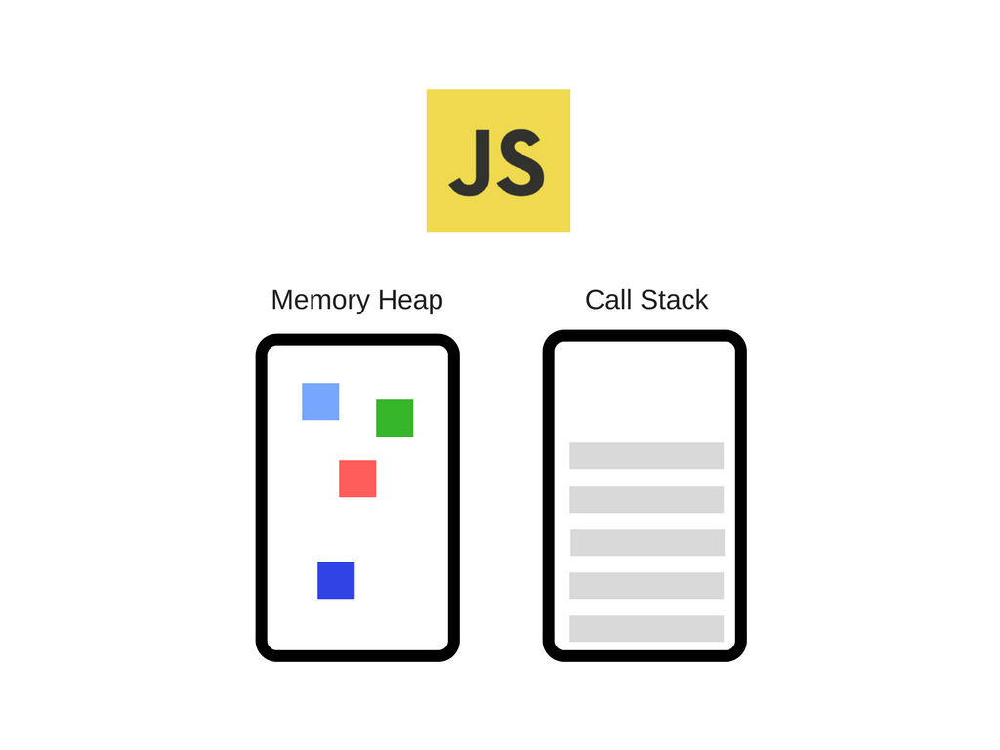

# 여기까지 오신걸 진심으로 축하드립니다.

- 여러분들은 이제 자바스크립트에 대한 스타트 지점에 도착하셨습니다.

## 자바스크립트가 뭐였죠?

> 자바스크립트는...음... 싱글 쓰레드에 논 블록킹 비동기적 동적 언어 였어요

- 이제 자바스크립트에 대해 다시 알아 보도록 하겠습니다

<p align="center"></p>
- 자바스크립트는 현재 인기가 높아지고 있는 언어이며 프론트,백,하이브리드,임베디드 많은 분야에서 지원 범위를 확대하고 있습니다.

- 그 증표로 깃허브에서 가장 많이 사용되는 언어로 JS가 꼽히게 되었습니다.

> 우리 일자리 늘어나는거야?!

- 첫시간에 JS에 대해 엄청 두리 뭉술하게 이해가 안가게 말했습니다.

- 그 이유는 비전공자와 전공자가 섞여 있는 여러분들에게 처음부터 많을것을 알려줄수도 알려드린다고 해도 알지 못하기 때문입니다.

## 자바스크립트 런타임 

- 그래서 오늘은 자바스크립트가 어떻게 돌아가는지 정말 중요한 Runtime에 대해 알려드리고자 합니다 

<p align="center"></p>

- 위 그림은 JS의 엔진 V8의 구조도를 간단히 나타낸 그림입니다.
    - Memory Heap : 메모리 할당이 일어나는 곳
    - Call Stack : 코드 실행에 따라 호출 스택이 쌓이는 곳

- 자 다시 돌아와 보겠습니다. JS는 싱글쓰레드 언어입니다. 

- 그걸 유추한다면 싱글 쓰레드 이기 때문에 `Call stack`은 하나라는 것이겠죠

- 하나의 프로그램은 동시에 하나의 코드만 실행할수 있다는 의미가 되겠습니다. 


```js
function multiply(x, y) {
    return x * y;
}
function printSquare(x) {
    var s = multiply(x, x);
    console.log(s);
}
printSquare(5);
```
- 위 코드의 실행을 따라가보면 아래와 같은 `Call Stack`그림으로 담기게 되고 실행이 됩니다.

- `Memory Heap`에는 호출 될때 메모리가 할당이 되고 있을겁니다.
<p align="center"></p>


```js
function foo() {
    foo();
}
foo();
```
- 만약 이렇게 무한히 반복 시키게 된다면  Call Stack은 터저버리면서 죽게됩니다. 
<p align="center"></p>

- 그럼 여러분 느려진다는것은 어떤 의미 일까요?

- 여러분들은 아직 비동기와 동기에 대해서 배우지 못했습니다. 하지만 추론을 할수 있을겁니다.

- 한프로그램이 엄청난게 많은 시간을 잡아 먹는다면 밑에있는 `console.log`가 출력 되는데 까지는 시간이 걸리게 된다는겁니다.

<p align="center"></p>

- 이렇게 `Call Stack`에서 꺼내서 일처리를 하나씩 끝내는 것이 `동기` 라고합니다.

- 하지만 js함수들은 대부분이 비동기로 만들어져 있습니다. 어떤 코드를 실행하면 결국 나중에 콜백 함수를 실행(만들어진 함수를 실행)시켜 실행한다는거죠 

<p align="center"></p>

- 위 결과를 유추 해보면 동기와 비동기에 대해서 알수 있을거라고 생각합니다.

- 이렇게 비동기를 사용하면 하나의 일을 할수있던 JS가 여러가지 일을 할수 있는 동시성을 살려주는 것이죠

- 비동기의 기능을 살려주는게 `web APIS`에서 하는 일입니다. 만약이게 Nodejs가 된다면 `C++API`가 대신 하게 되는거겠죠

<p align="center"></p>

- 예시를 통해 살펴 보도록 하겠습니다

<p align="center"></p>
